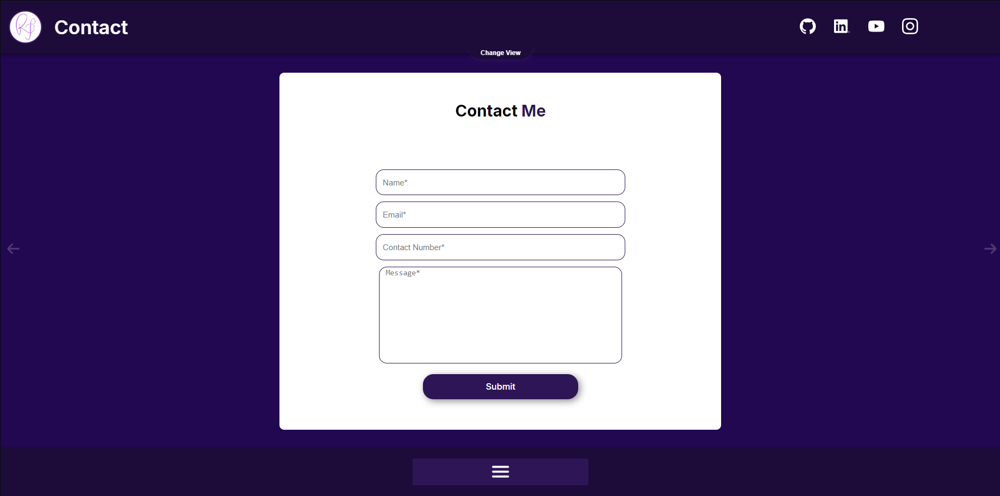
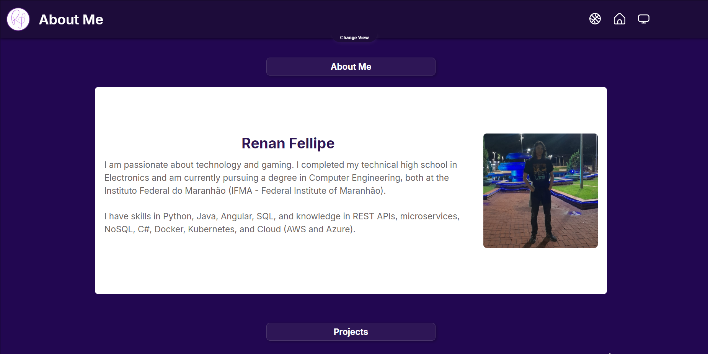
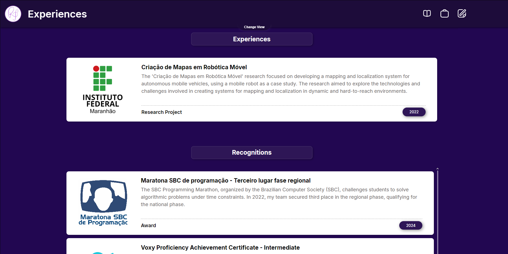

# 📌 Portfólio 

Welcome to my portfolio! Here, you'll find a collection of my projects, experiences, certifications, and achievements in the field of technology.

## 🧑‍💻 About Me

I'm Renan Fellipe, a Computer Engineering student at IFMA, passionate about technology and software development. I have experience in backend and full-stack development, with a focus on .NET, Java, Spring Boot, C#, and Angular, as well as knowledge in Cloud Computing, Microservices, REST APIs, Docker, Kubernetes, and SQL/NoSQL databases.

I'm part of Class 10 of the University Ambassadors Program at DIO, where I share knowledge and support the tech community. I also competed in the SBC Programming Marathon, placing 3rd in the regional phase and securing a spot in the national phase.

## 🏆 Achievements and Certifications

- 📜 Certifications in .NET, Spring Boot, Software Architecture, Cloud Computing, and Python through programs like Randstad, CI&T Next Gen, Microsoft Azure Essentials, Deal, Cognizant, and Claro.

- 💡 Research Project on Mapping and Localization for Mobile Robotics, using Python and Arduino.

- 📈 Participation in hackathons and technical challenges, always seeking innovation and scalable solutions.

## 🚀 Featured Projects
Here you’ll find some of my most relevant projects, including:

- ✔️ RESTful APIs for user, task, and vehicle management, developed with .NET (Minimal API) and Spring Boot.

- ✔️ Interactive Web Applications built with Angular and TypeScript.

- ✔️ Personal Projects like a BuzzFeed clone and a fanmade Pokémon game.

## 📬 Contact

Want to connect or collaborate on a project? Feel free to reach out!

📧 Email: 1renanfellipe5@gmail.com

🔗 LinkedIn: https://www.linkedin.com/in/renan-fellipe/

🐙 GitHub: https://github.com/Xounder

📺 YouTube: https://www.youtube.com/@Xounder_Tech

# Web Portfólio

The draft of this web portfolio, made in ***Figma***, can be found [here](https://www.figma.com/design/ftce0BXRJQSJXE3HjsqYGD/Portfolio?node-id=0-1&t=FJNZjil7Wk8QCEn7-1).

## Home Page

## Scroll Page

## How to Run

Insert these comands in comand line

- `npm install` -> _Installs the project dependencies_

- `npm run dev` -> _Starts the React application in a development server_
